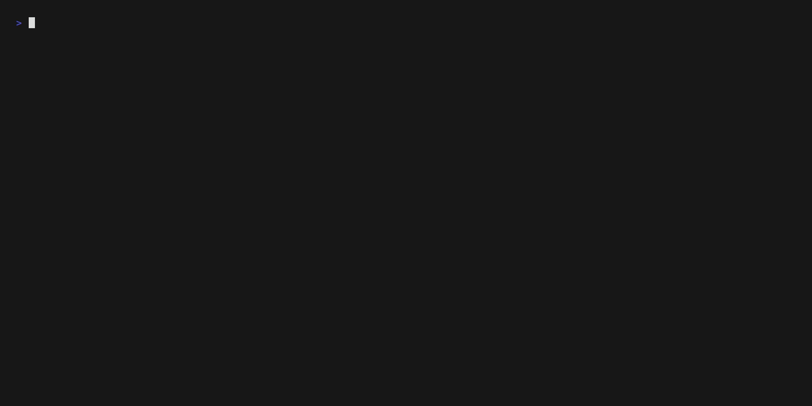

<div align="center">
    <h1>Tempus</h1>
    <strong>Minimalist Terminal Timer with Style</strong>
    
</div>

## Features

- **Beautiful Progress Visualization** - 4 visual themes with smooth transitions
- **Preset Timers** - Quick access to common timers (pomodoro, breaks, etc.)
- **Notification Options** - Desktop and sound alerts when your timer completes
- **Focus Mode** - Full-screen TUI interface with keyboard controls
- **Minimal Interface** - Clean and elegant design that stays out of your way
- **Color Configuration** - Honors the `NO_COLOR` environment variable
- **Countdown Mode** - Set timers to specific dates and times

## Installation

The recommended way of installing Tempus is with [Nix](https://nixos.org/).
Simply install it with `nix profile install github:NotAShelf/tempus` or add it
as a flake input.

Or build from source:

```bash
git clone https://github.com/notashelf/tempus.git
cd tempus
cargo build --release
```

## Usage

```bash
# Basic timer - 5 minutes
tempus 5m

# Pomodoro preset with notifications
tempus -p pomodoro -n

# Custom timer with a name and rainbow theme
tempus 30m -n "Meditation" -t rainbow

# Short break without sound notification
tempus -p short-break --bell=false

# Use without colors (you can also set the NO_COLOR env variable)
NO_COLOR=1 tempus 5m

# Countdown to a specific time (today or tomorrow)
tempus countdown 20:00

# Countdown to a specific date and time
tempus countdown "2025-12-31 23:59:59" --name "New Year"

# Countdown with a theme
tempus countdown "2025-05-10" --theme rainbow

# Countdown with big clock display
tempus countdown "14:30" --big
```

## Progress Bar Themes

Tempus comes with four default themes:

- **Gradient** - Colors shift from green to yellow to red (default)
- **Rainbow** - Colorful display with blocks in rainbow colors
- **Pulse** - Animated pulsing effect with cyan/blue colors
- **Plain** - Classic monochrome style for distraction-free focus

## Command Line Options

### Main Options

| Option          | Description                              |
| --------------- | ---------------------------------------- |
| `-n, --name`    | Give your timer a name                   |
| `-v, --verbose` | Show more detailed output                |
| `-t, --theme`   | Choose progress bar theme                |
| `-p, --preset`  | Use a preset duration                    |
| `-b, --bell`    | Enable/disable terminal bell sound       |
| `-N, --notify`  | Send desktop notification when completed |
| `-f, --focus`   | Enable full-screen focus mode TUI        |
| `--big`         | Show big ASCII art clock mode            |

### Countdown Subcommand

| Subcommand         | Description                                        |
| ------------------ | -------------------------------------------------- |
| `countdown <DATE>` | Start a countdown to a specific date/time          |

The countdown subcommand supports various date and time formats:
- Full date and time: `"2025-12-31 23:59:59"`
- Date with time: `"2025-12-31 20:00"`
- Date only: `"2025-12-31"` (counts down to midnight)
- Time only: `"20:00"` or `"20:00:00"` (counts down to that time today or tomorrow)
- RFC 3339 format: `"2025-12-31T23:59:59-04:00"`

If you specify only a time that has already passed today, it will automatically count down to that time tomorrow.

### Available Presets

- `pomodoro` - 25 minutes
- `short-break` - 5 minutes
- `long-break` - 15 minutes
- `tea` - 3 minutes
- `coffee` - 4 minutes

### Environment Variables

- `NO_COLOR` - When set (to any value), all colored output will be disabled and the Plain theme will be used

## Building & Contributing

Contributions are welcome! Please feel free to submit a Pull Request.

## Attribution

Tempus is greatly inspired by [clock-tui](https://github.com/race604/clock-tui) and [timer](https://github.com/caarlos0/timer).

## License

This project is licensed under the MPL v2.0 License - see the [LICENSE file](LICENSE)
for details.
